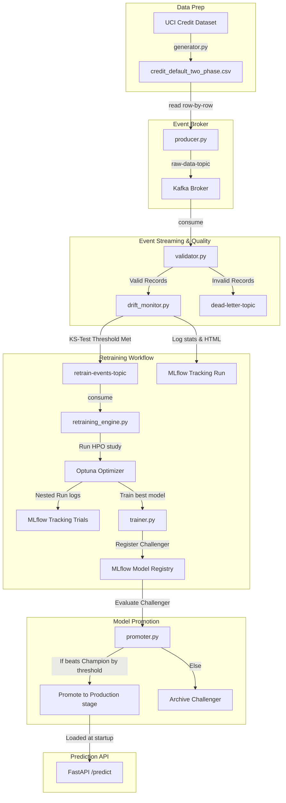

# DriftGuard: Event-Driven Drift-Aware MLOps Pipeline

<p align="center">
  
  
  
  
  
</p>

DriftGuard is a production-inspired, closed-loop MLOps system that streams credit client records, validates incoming features against schemas, monitors for statistical data drift, automatically triggers hyperparameter-optimized model retraining, and serves predictions via a FastAPI endpoints.

> [!NOTE]
> For a line-by-line developer code walkthrough, technical interview question list, and statistical explanations, check out the **[Complete Study Guide](file:///D:/CODE/Projects/Event-Driven%20MLOPS/STUDY.md)**.

---

## 1. System Topology & Data Flow



---

## 2. Directory Layout & Code Map

* 📁 **[config/](file:///D:/CODE/Projects/Event-Driven%20MLOPS/config)**
  * [config.yaml](file:///D:/CODE/Projects/Event-Driven%20MLOPS/config/config.yaml): All magic numbers, windows, and thresholds (Single Source of Truth).
* 📁 **[data/](file:///D:/CODE/Projects/Event-Driven%20MLOPS/data)**
  * [generator.py](file:///D:/CODE/Projects/Event-Driven%20MLOPS/data/generator.py): Prepares two-phase dataset and injects feature drift.
* 📁 **[producer/](file:///D:/CODE/Projects/Event-Driven%20MLOPS/producer)**
  * [producer.py](file:///D:/CODE/Projects/Event-Driven%20MLOPS/producer/producer.py): streams records into raw Kafka topic.
* 📁 **[consumer/](file:///D:/CODE/Projects/Event-Driven%20MLOPS/consumer)**
  * [validator.py](file:///D:/CODE/Projects/Event-Driven%20MLOPS/consumer/validator.py): Filters invalid records to the Dead Letter Queue (DLQ).
  * [drift_monitor.py](file:///D:/CODE/Projects/Event-Driven%20MLOPS/consumer/drift_monitor.py): Implements sliding window KS-test and triggers alerts.
  * [retraining_engine.py](file:///D:/CODE/Projects/Event-Driven%20MLOPS/consumer/retraining_engine.py): Listens for alerts, runs HPO, and registers challenger models.
* 📁 **[model/](file:///D:/CODE/Projects/Event-Driven%20MLOPS/model)**
  * [trainer.py](file:///D:/CODE/Projects/Event-Driven%20MLOPS/model/trainer.py): Standard XGBoost training wrapper.
  * [train_baseline.py](file:///D:/CODE/Projects/Event-Driven%20MLOPS/model/train_baseline.py): Script to establish and register baseline Production champion.
  * [train_optuna.py](file:///D:/CODE/Projects/Event-Driven%20MLOPS/model/train_optuna.py): Reusable Optuna search study loop.
  * [promoter.py](file:///D:/CODE/Projects/Event-Driven%20MLOPS/model/promoter.py): Holdout model evaluator.
  * [registry.py](file:///D:/CODE/Projects/Event-Driven%20MLOPS/model/registry.py): MLflow Model Registry helper functions.
* 📁 **[api/](file:///D:/CODE/Projects/Event-Driven%20MLOPS/api)**
  * [app.py](file:///D:/CODE/Projects/Event-Driven%20MLOPS/api/app.py): Serving API serving Production model.
* 📁 **[utils/](file:///D:/CODE/Projects/Event-Driven%20MLOPS/utils)**
  * [config_loader.py](file:///D:/CODE/Projects/Event-Driven%20MLOPS/utils/config_loader.py): Standard configuration file loader.
  * [schema.py](file:///D:/CODE/Projects/Event-Driven%20MLOPS/utils/schema.py): Pandera Schema validator.
  * [kafka_utils.py](file:///D:/CODE/Projects/Event-Driven%20MLOPS/utils/kafka_utils.py): Shared consumer/producer initializations.
  * [drift_utils.py](file:///D:/CODE/Projects/Event-Driven%20MLOPS/utils/drift_utils.py): SciPy Kolmogorov-Smirnov statistical formula.

---

## 3. Fast Setup & Launch Guide

### 1. Initialize Virtual Environment & Packages
```powershell
python -m venv .venv
.\.venv\Scripts\Activate.ps1
pip install -r requirements.txt
```

### 2. Launch Kafka Broker & Zookeeper
```powershell
docker compose up -d
```

### 3. Initialize Production Champion (v1)
```powershell
python -m model.train_baseline
```

### 4. Boot Up Event Consumers
Launch three separate terminals, activate the virtual environment, and run:
```powershell
# In terminal 1: Ingestion Quality Gateway
python -u -m consumer.validator

# In terminal 2: KS-Test Drift Watchdog
python -u -m consumer.drift_monitor

# In terminal 3: Automated Retraining Listener
python -u -m consumer.retraining_engine
```

### 5. Start Inference REST API
```powershell
python -m uvicorn api.app:app --host 127.0.0.1 --port 8000
```

### 6. Begin Ingestion Stream
```powershell
python -m producer.producer
```

---

## 4. Operational Features

### Ingestion Validation & Dead Letter Queue (DLQ)
All records undergo strict type coercion and value boundaries. Bad events (e.g. `AGE < 18` or malformed JSON payloads) are packaged with validation error traces and routed to `dead-letter-topic` for auditing and resolution.

### Kolmogorov-Smirnov Sliding Window Drift Check
Drift is computed dynamically:
* Reference Window: Static first `1000` clean records.
* Current Window: Sliding queue of `500` records.
* Interval: Analysis runs every `100` records.
* If `>= 2` features indicate p-value $< 0.05$, a retraining alert is dispatched. Evidently AI reports are generated and uploaded to MLflow on every check cycle.

### Champion-Challenger Holdout Gate
To prevent regression and overfitting:
* The retraining engine starts an Optuna search (30 trials) with `TPESampler` and `MedianPruner` using the validation F1 score.
* The promoter evaluates the challenger version against the active Production model on a static Holdout set (`data/holdout.parquet`).
* Challenger is promoted to `Production` only if: $F1_{challenger} > F1_{champion} + 0.005$.
* Active model hot-reloads instantly without downtime via FastAPI `/reload`.
